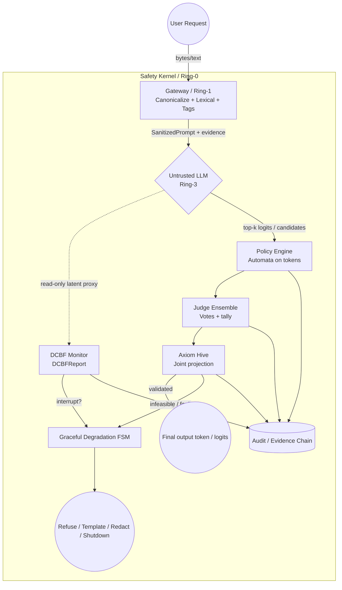

# RFC: Decoupled Safety Kernel Architecture (v0.2-r2)

**Author:** Anthropic Claude Code

**Supersedes:** `Decoupled Safety Kernel Architecture RFC_v0.2.md`（v0.2 正文；本文件为 **r2 收口修订**，冻结前歧义压平）

**Prior art:** `Decoupled Safety Kernel Architecture RFC_v0.1.md`（contract-first 修订版）

**Incorporates:** `Decoupled Safety Kernel Architecture RFC_v0.2_review.md`（首轮治理补强）; `Decoupled Safety Kernel Architecture RFC_v0.2_r2_review.md`（渲染/类型闭合/fault 粒度/索引语义等）

**Target audience:** 架构委员会、安全评审、内核/系统实现团队

**Status:** Draft — 规范冻结前收口稿

---

## 文档表示约定（渲染）

全文 **Mermaid** 使用 ` ```mermaid ` 围栏；**Rust/伪代码**使用 ` ```rust ` 围栏；**块级数学**使用 `$$ ... $$`。复制或抓取时须保留围栏，以保证渲染与 diff 可审计。

---

## 摘要（Abstract）

本 RFC 定义与基础大语言模型（LLM）**解耦**的 **Safety Kernel**：将基础模型视为 Ring-3 **非可信**用户态生成进程，在 Ring-0/1 以**可审计契约**强制执行输入净化、离散时间 DCBF 监测、DSL→自动机策略、多验证器裁决、候选集联合投影及 Graceful Degradation。规范要求每步生成在**有界时间**内完成，默认在冲突、不可行、超时或审计失败时走 **fail-safe**（以 deny/降级为主），并通过 **Audit / Evidence Chain** 绑定 `trace_id` 与规则/系数版本。

**非目标**不在摘要展开，见第 1 节；**威胁模型**见第 2 节；**全局安全不变量**见第 8 节（含 I6 提交顺序）；**故障分类**见第 9 节；**验证与配置**见第 11–13 节。

**关键词：** decoupled safety、control barrier function、runtime policy automaton、verifier ensemble、constraint projection、evidence chain、hard latency budget

---

## 规范性用语（RFC 2119）

文中 **必须（MUST）**、**不得（MUST NOT）**、**建议（SHOULD）**、**可选（MAY）** 的含义与 [RFC 2119](https://www.rfc-editor.org/rfc/rfc2119) 一致。

---

## 0. 设计目标与原则

本 RFC 定义与基础模型**解耦**的 **Safety Kernel**：基础 LLM 视为 **Ring-3 非可信、随机、用户态生成进程**；Safety Kernel 为 **特权态外生约束系统**，负责：

- 输入规范化、净化与边界隔离  
- 隐状态轨迹的**离散时间**安全监测（DCBF）  
- 安全规则 DSL 的解析、降级与确定性自动机执行  
- 多验证器的**可审计**裁决（非单一布尔）  
- 在安全可行域上对 **候选集 / 对数概率 / 能量** 的联合投影与故障处理  
- 安全与活性冲突时进入 **Graceful Degradation 状态机**

**核心原则：**

> Safety is an **external invariant** and an **auditable contract**, not an emergent property of the base model.

**失败默认（实现 MUST 遵守）：**

| 条件                                      | 默认动作                                        |
| --------------------------------------- | ------------------------------------------- |
| `Finding.severity == Critical`（Gateway） | **Hard Reject**（拒绝进入后续生成或直接安全模板）；与第 5.1 节一致 |
| Verifier 冲突 / 证据不足                      | **Deny**（拒绝或安全模板）                           |
| 投影不可行 / QP 超时                           | **PageFault 路径** → 降级 FSM                   |
| 步级总预算耗尽                                 | **DeadlineExceeded** → 降级 FSM               |
| 审计记录写入失败（若策略要求）                         | **Fail-safe**（由部署策略定义；**建议** deny）          |

---

## 1. 非目标（Non-Goals）

以下内容 **明确不在** 本 RFC 承诺范围内；实现者与评审 **不得** 将其误读为规范义务：

1. **不**证明或验证黑盒基础模型在**全输入空间**上“全局永远安全”（与全局隐式安全不可判定性结论一致）。  
2. **不**将自然语言 prompt 本身作为**唯一**运行时策略源；策略 MUST 经 DSL 解析/编译为可执行工件（自动机/检查器配置）。  
3. **不**声称所有语法/合规约束均可等价嵌入 **latent space**；latent 侧仅作用于**约定的只读代理**。  
4. **不**依赖**单一**大模型 Judge 作为**最终**仲裁；最终允许语义 MUST 来自 **Ensemble 协议 + 默认 deny**。  
5. **不**规定具体硬件（TEE、GPU 内核模式等）；与 TEE 的绑定为开放性工作。

---

## 2. 威胁模型（Threat Model）

### 2.1 攻击面分层

| 层      | 威胁示例                          | 主要缓解组件                                      |
| ------ | ----------------------------- | ------------------------------------------- |
| **输入** | 编码混淆、Unicode 规范化差异、边界污染、注入式指令 | Gateway（canonicalization + tags + findings） |
| **生成** | 潜轨迹逼近禁止方向、自回归放大有害模式           | DCBF Monitor、`DCBFReport`、投影收紧              |
| **输出** | 结构非法、多验证器冲突、投影不可行/超时          | Automata、`EnsembleReport`、Axiom Hive、降级 FSM |

### 2.2 对手能力假设（收紧版）

**攻击者能力（能做什么）**：多轮黑盒交互访问（Hard-label，即仅获得最终生成的文本流，无法获取 Logits/内部权重）。支持自适应查询、提示注入（Prompt Injection）、利用并发依赖的组合攻击（Conjunctive capability hypergraph attack）。对手可控制**用户可见输入**（及部分上下文），**不得**假设**已突破** Ring-0 Safety Kernel 的完整性（若假设被违反，则退化为**主机沦陷**模型，超出本文档范围）。基础 LLM **可能**与对手输入对齐而产生有害 logits；Safety Kernel MUST 在**不信任**模型输出的前提下裁决。

**攻击者知识（Kerckhoffs 边界）**：白盒了解防御架构体系（即知道系统部署了解耦安全内核与 DCBF 监控器），但**黑盒**面对具体的安全策略参数（Safety Predicate Policies）和后端的具体模型权重。

**攻击者限制（不能做什么）**：无法进行物理内存读写；无法进行白盒梯度反向传播；受到严格的系统级交互预算约束（单会话最大轮数 $N$ 与最大生成 Token 数 $T$）。

**成功判据与预算约束**：攻击在给定查询预算 $B$ 内，使得输出状态突破 DCBF 定义的安全超水平集（Safe Superlevel Set），从而完成对受保护资产的确切提取（Exact Extraction）或非授权功能调用。

### 2.3 安全目标（概要）

- **机密性/完整性**（对策略与审计日志）：策略加载与审计路径 MUST 具备部署定义的信任根。  
- **可用性**：在攻击下允许**降级**，但 MUST NOT 在 deny 策略下“静默放行”高危输出。
- **计算不对称（Computational Asymmetry）**：安全验证在多项式时间内完成（$\mathcal{O}(|C| \cdot p(|x|))$），而攻击者的全局绕过在有限查询预算 $B$ 内不可判定。放弃不可判定的全局语义安全，转向具有前向不变性（Forward Invariance）与多项式时间可证的实例级运行时安全。

---

## 3. 架构拓扑：分层 + 权责 + 证据链

### 3.1 Ring 与信任边界

| 环          | 组件                                                                            | 典型权限                         |
| ---------- | ----------------------------------------------------------------------------- | ---------------------------- |
| **Ring-3** | Untrusted LLM（自回归核）                                                           | 仅用户态缓冲；**无**策略写权限            |
| **Ring-1** | Gateway（规范化 / 词法 / 边界）                                                        | 读请求；输出规范化流 + **policy_tags** |
| **Ring-0** | DCBF Monitor、Policy Engine、Judge Ensemble、Axiom Hive、Graceful Degradation FSM | 可中断生成步；可写**审计与裁决**           |
| **横切**     | **Audit Log / Evidence Chain**（强制）                                            | 只追加；与每次 token 步绑定 `trace_id` |

### 3.2 职责细化

- **Gateway**：区分 **canonicalization**、**lexical matching**、**boundary sanitization**、**policy tagging**。  
- **DCBF Monitor**：输入为 **latent 只读代理**；near-violation 时 **软收紧**或 **硬中断**（`DCBFReport.interrupt`）。  
- **Judge Ensemble**：**多 Verifier + 投票/计票**；禁止坍缩为单 `bool`。  
- **Axiom Hive**：对 **candidate set / logits / DCBF / ensemble / deadline** 联合决策。  
- **Graceful Degradation**：显式 **FSM**（Refuse / Template / Redact / Shutdown）。

### 3.3 架构图（Mermaid）



---

## 4. 约束三类分解（避免 latent/token 语义混杂）

1. **Lexical / structural（词法/结构）**  
   Gateway + DSL 编译产物在 **token 序列**上判定前缀合法性。

2. **Latent trajectory（潜轨迹）**  
   DCBF 仅在**约定的只读代理表示**上检查离散时间屏障；**不**声称全部语法约束可嵌入潜空间。

3. **Output legality / semantic contracts（输出合法性/语义契约）**  
   Judge Ensemble +（可选）外部确定性检查器；与 (1)(2) **正交**，结果 MUST 进入证据链。

---

## 5. 核心接口（厚契约 + 证据）

以下 Rust 风格接口为 **规范意图**；实现可拆分 crate，但**字段语义不得删减**（MUST NOT 弱化）。

### 5.0 核心类型最小契约（Normative Type Surface）

下列类型 **不要求** 在本 RFC 中给出完整实现，但实现 MUST 满足最小语义，以便多实现可对齐：

| 类型                                                | 最小语义（MUST）                                                                                                                                                                                                       |
| ------------------------------------------------- | ---------------------------------------------------------------------------------------------------------------------------------------------------------------------------------------------------------------- |
| `Token`                                           | 表示模型可见的最小离散输出单位；实现 MAY 使用 token id、BPE 单元或文法符号，但 MUST 可映射回审计可见的文本片段（或等价审计句柄）。                                                                                                                                    |
| `LatentState`                                     | **只读代理**状态，**不等同于**完整模型内部状态；MUST 声明来源层、维度与 probe / 编码版本并写入审计绑定。                                                                                                                                                  |
| `DeterministicAutomaton`                          | 可增量验证前缀合法性的确定性工件；MUST 支持状态/版本摘要进入审计（如 `automaton_revision`）。                                                                                                                                                     |
| `Ast`                                             | DSL 解析树；仅经 `lower` 进入 `DeterministicAutomaton`，**不得**作为运行时唯一策略源。                                                                                                                                                 |
| `VerificationContext`                             | MUST 至少包含 `trace_id`、`step_index`、`policy_revision`，以及前缀的 token/text 视图（部署定义其一或二者）。若**同时**提供 token 与 text 视图，二者 MUST 可相互映射并在审计中与同一 `step_index` 绑定；实现 **MUST NOT** 允许 Verifier 基于与自动机所用前缀视图**不一致**的视图作出最终放行决定。   |
| `CompileError` / `ParseError` / `AutomatonReject` | 可序列化故障类别，供遥测与降级路由；MUST NOT 静默吞没。                                                                                                                                                                                 |
| `SystemFault`                                     | Gateway 等子系统不可恢复错误；调用方 MUST 映射为 0 节 fail-safe 或 `SafetyFault`。                                                                                                                                                   |
| `SafetyFault`                                     | MUST 可区分第 9 节 `GatewayFault` / `MonitorFault` / `PolicyFault` / `VerifierFault` / `ProjectionFault` / `KernelFault`（可组合），并 MUST 区分第 9.1 节 `MissingSanitizedPrompt` 与 `EmptySafeCandidateSet`（**不得**混用为单一“证据缺失”）。 |
| `ExecutionContext`                                | 单次请求/会话的执行句柄；MUST 持有本步前缀、`VerificationContext`、**请求级** `SanitizedPrompt`（见 6 节）、**请求级 monotonic deadline**（或等价的剩余步级预算状态）、以及当前审计/提交句柄（与 I6 对齐）。上述字段生命周期 MUST 覆盖整请求。                                               |
| `SafetyKernel`                                    | 聚合 `GatewayFilter`、`DCBFEvaluator`、`SafetyDSLCompiler`、`JudgeEnsemble`、`AxiomHiveBoundary`、`GracefulDegradation` 与审计端口；LLM **不得**为其子类型。                                                                          |
| `SafeToken`                                       | 对用户可见的最终输出单元；若为降级产物，MUST 可追溯至 `DegradeAction`（Template / Refuse / Redact 等）。                                                                                                                                     |

### 5.1 Gateway

```rust
pub enum Severity {
    Info,
    Warn,
    High,
    Critical,
}

pub struct Finding {
    pub rule_id: String,
    pub span: std::ops::Range<usize>,
    pub severity: Severity,
}

pub struct SanitizedPrompt {
    pub canonical: Vec<u8>,
    pub findings: Vec<Finding>,
    pub policy_tags: Vec<String>,
}

pub trait GatewayFilter {
    fn sanitize_input(&self, raw_input: &[u8]) -> Result<SanitizedPrompt, SystemFault>;
}
```

实现 MUST 将 `Finding.severity == Critical` 映射为**可直接 hard reject** 的路径（拒绝进入后续生成或强制安全模板），且该裁决 MUST 进入审计。

### 5.2 DCBF

```rust
pub struct DCBFReport {
    pub h_t: f32,
    pub h_t1: f32,
    pub margin: f32,
    pub near_violation: bool,
    pub interrupt: bool,
    pub barrier_id: Option<String>,
}

pub trait DCBFEvaluator {
    fn check_forward_invariance(
        &self,
        state_t: &LatentState,
        state_t1: &LatentState,
        alpha: f32,
    ) -> DCBFReport;
}
```

### 5.3 Safety DSL

```rust
pub trait SafetyDSLCompiler {
    fn parse(&self, dsl_rules: &str) -> Result<Ast, ParseError>;
    fn lower(&self, ast: &Ast) -> Result<DeterministicAutomaton, CompileError>;
    fn validate_prefix(
        &self,
        automata: &DeterministicAutomaton,
        prefix: &[Token],
        next: Token,
    ) -> Result<(), AutomatonReject>;
}
```

### 5.4 Judge Ensemble

```rust
pub enum Vote {
    Allow,
    Revise,
    Deny,
    Abstain,
}

pub struct Verdict {
    pub vote: Vote,
    pub confidence: f32,
    pub explanation: String,
    pub verifier_id: String,
}

pub struct EnsembleReport {
    pub verdicts: Vec<Verdict>,
    pub tally_allow: u32,
    pub tally_revise: u32,
    pub tally_deny: u32,
    pub tally_abstain: u32,
    pub conflict: bool,
    pub final_action: Vote,
}

pub trait JudgeEnsemble {
    fn verify(
        &self,
        candidate: &Token,
        ctx: &VerificationContext,
    ) -> EnsembleReport;
}
```

`final_action` MUST 由**显式计票策略**（部署注册）导出；`conflict == true` 时 `final_action` MUST 为 `Deny`，除非已审计的 **break-glass** 策略显式放行（见 I4）。实现 MUST 将所用策略标识写入审计。

### 5.5 Axiom Hive

```rust
pub struct CandidateVerdict {
    pub index: usize,
    pub ensemble: EnsembleReport,
}

pub struct ProjectionInput<'a> {
    pub logits: &'a [f32],
    pub topk_indices: &'a [usize],
    pub candidate_verdicts: &'a [CandidateVerdict],
    pub automata: &'a DeterministicAutomaton,
    pub dcbf: &'a DCBFReport,
    pub deadline: std::time::Instant,
}

pub struct ProjectionOutput {
    pub chosen_index: Option<usize>,
    pub feasible: bool,
    pub energy: f32,
    pub distance: f32,
    pub page_fault: bool,
}

pub trait AxiomHiveBoundary {
    fn enforce_projection(&self, input: ProjectionInput<'_>) -> ProjectionOutput;
}
```

**规范语义（MUST）：** Axiom Hive 的输入候选集 MUST 为：在 `topk_indices` 上**前缀合法**（`validate_prefix` 成功）且该候选的 `EnsembleReport.final_action != Deny` 的条目；`ProjectionInput.candidate_verdicts` MUST **一一对应**上述候选（每项携带其 `index` 与完整 `EnsembleReport`）。若 `feasible == false` 或 `page_fault == true`，`chosen_index` MUST 为 `None`。

**索引匹配（MUST，消除 zip 歧义）：** `candidate_verdicts` 的条目顺序 MAY 与 `topk_indices` 不同，但每项 **MUST** 携带其自身的 `index`；`AxiomHiveBoundary::enforce_projection` **MUST** 按 **index 身份**解析 logits 与裁决，**禁止**假定 `topk_indices` 与 `candidate_verdicts` 按下标位置 zip 一一对应。确定性实现 **SHOULD** 保持与 `topk_indices` 相同的迭代顺序；若顺序不同，**仍 MUST** 仅依赖 `index` 匹配。

### 5.6 Graceful Degradation

```rust
pub enum DegradeAction {
    EmitSafeTemplate,
    Refuse,
    Redact,
    Shutdown,
}

pub trait GracefulDegradation {
    fn on_fault(&self, fault: SafetyFault) -> DegradeAction;
}
```

---

## 6. 控制主循环（top-k → 自动机 → 投票 → 投影 → 降级）

每步围绕 **安全候选集上的最小偏移选择**，而非单 token 事后补救。

### 6.0 Gateway 与步级语义

**MUST：** `GatewayFilter::sanitize_input` 在 **请求/会话初始化**阶段执行（每用户请求或等价会话边界至少一次），结果写入 `ExecutionContext` 为 `SanitizedPrompt`。**不得**将伪代码解读为“每个 token 步必须重新完整 sanitize”；若实现选择在步级再次调用，MUST 等价于使用已缓存的 `<SanitizedPrompt>` 且该选择 MUST 可审计。`generate_token_intercept` **只消费**上下文中的 `SanitizedPrompt`，避免与“单步拦截”语义混淆。

### 6.1 主循环（伪代码）

**break-glass（MUST）：** 普通路径将 `Vote::Deny` 视为候选上的**终止**裁决。任何 break-glass 覆盖 MUST 在 `EnsembleReport.final_action` 产出**之前**解析完成，且覆盖事件 MUST 已写入审计；**禁止**在投影阶段对 `Deny` 再“临时翻案”。

```rust
const HARD_LATENCY_BUDGET: Duration = Duration::from_millis(20);
const QP_INNER_BUDGET: Duration = Duration::from_millis(5);

/// 请求入口（示意）：MUST 在首 token 步之前完成。
pub fn init_request_sanitized(
    ctx: &mut ExecutionContext,
    kernel: &SafetyKernel,
) -> Result<(), SystemFault> {
    let sp = kernel.gateway.sanitize_input(ctx.raw_user_bytes())?;
    ctx.set_sanitized_prompt(sp);
    Ok(())
}

pub async fn generate_token_intercept(
    ctx: &mut ExecutionContext,
    kernel: &SafetyKernel,
) -> SafeToken {
    let result = timeout(HARD_LATENCY_BUDGET, async {
        let _sanitized = ctx
            .sanitized_prompt()
            .ok_or(SafetyFault::MissingSanitizedPrompt)?;

        let (latent_t, latent_t1) = ctx.untrusted_llm.peek_latent_trajectory().await;
        let dcbf = kernel.dcbf.check_forward_invariance(&latent_t, &latent_t1, 0.1);
        kernel.audit.append_step("dcbf", &dcbf);

        if dcbf.interrupt {
            return Err(SafetyFault::LatentSpaceViolation(dcbf));
        }

        let (logits, topk_idx) = ctx.untrusted_llm.topk_logits(&latent_t1, K).await;

        let mut legal: Vec<usize> = Vec::new();
        let mut candidate_verdicts: Vec<CandidateVerdict> = Vec::new();
        for &i in topk_idx {
            let tok = ctx.untrusted_llm.index_to_token(i);
            if kernel
                .compiler
                .validate_prefix(&kernel.automata, ctx.prefix_tokens(), tok)
                .is_ok()
            {
                let ens = kernel.judge_ensemble.verify(&tok, &ctx.vctx);
                kernel.audit.append_step("ensemble", &ens);
                if ens.final_action != Vote::Deny {
                    legal.push(i);
                    candidate_verdicts.push(CandidateVerdict {
                        index: i,
                        ensemble: ens,
                    });
                }
            }
        }

        if legal.is_empty() || candidate_verdicts.is_empty() {
            return Err(SafetyFault::EmptySafeCandidateSet);
        }

        let po = kernel.axiom_hive.enforce_projection(ProjectionInput {
            logits: &logits,
            topk_indices: &legal,
            candidate_verdicts: &candidate_verdicts,
            automata: &kernel.automata,
            dcbf: &dcbf,
            deadline: Instant::now() + QP_INNER_BUDGET,
        });

        if !po.feasible || po.page_fault {
            return Err(SafetyFault::UnrecoverablePageFault(po));
        }

        let idx = po
            .chosen_index
            .ok_or(SafetyFault::UnrecoverablePageFault(po))?;
        Ok(ctx.untrusted_llm.index_to_token(idx))
    })
    .await;

    match result {
        Ok(Ok(tok)) => tok,
        Ok(Err(f)) => kernel.degradation.on_fault(f).into_token(),
        Err(_) => kernel
            .degradation
            .on_fault(SafetyFault::DeadlineExceeded)
            .into_token(),
    }
}
```

每候选的 `EnsembleReport` MUST 完整进入 `candidate_verdicts` 并可供审计回放；**禁止**再以“单一占位报告”代表整集合法候选。

**Fault 语义：** `MissingSanitizedPrompt` 表示请求初始化契约被破坏；`EmptySafeCandidateSet` 表示当前步不存在前缀合法且 non-deny 的候选集（见第 9.1 节）。

---

## 7. 数学映射（文本可审计）

### 7.1 记号

- 令 $z \in \mathbb{R}^d$ 为潜空间**代理**向量；它 **不等同于**完整模型内部状态。  
- 令 $C \subseteq \mathbb{R}^d$为潜空间可行域（若部署启用潜空间侧约束/投影）。  
- 令 $z_{\mathrm{cand}}$ 表示由当前候选集与对数概率（或等价工程表示）导出的**候选点**；具体构造由实现定义，其版本与绑定 MUST 可审计。  
- **Token 级合法性**由有限自动机单独维护；**不得**仅凭潜空间可行域 \(C\) 声称覆盖全部语法约束。

### 7.2 禁止区能量

$$
E_{\mathrm{forbid}}(z) =
\begin{cases}
0, & z \in C \\
\eta \cdot \phi\bigl(\mathrm{dist}(z,\partial C)\bigr), & z \notin C
\end{cases}
$$

$\eta$ 为大惩罚；$\phi$ 可为二次或 reciprocal wall；实现 MUST 配置 **residual 阈值**与**时间上限**。

### 7.3 总能量（工程语义）

$$
H(z) = E_{\mathrm{model}}(z) + E_{\mathrm{forbid}}(z)
$$

其中 \(E_{\mathrm{model}}\) 的版本、系数与实现标识 MUST 进入审计（见第 11 节）。

### 7.4 投影

$$
z^\star = \arg\min_{z \in C} \; \|z - z_{\mathrm{cand}}\|_2^2 + \lambda \, E_{\mathrm{forbid}}(z)
$$

`ProjectionOutput` MUST 填充 `feasible`、`energy`、`distance`、`page_fault`、`chosen_index: Option<usize>`；若 `feasible == false` 或 `page_fault == true`，`chosen_index` MUST 为 `None`（与第 5.5 节一致）。

### 7.5 DCBF

$$
h(x_{t+1}) \ge (1-\alpha)\, h(x_t), \quad \alpha \in (0,1]
$$

因此可定义屏障裕度（与 `DCBFReport.margin` 对齐的工程实现）：

$$
\mathrm{margin} = h(x_{t+1}) - (1-\alpha)\, h(x_t)
$$

### 7.6 PageFault 触发（任一）

- 投影不可行；QP 超 `QP_INNER_BUDGET`；残差/KKT 超阈值；Ensemble 冲突且策略 deny。

---

## 8. 安全不变量（Safety Invariants）

以下不变量在**单请求、单 token 步**语义下 MUST 成立（除非进入已审计的 Shutdown 路径）：

1. **I1（裁决隔离）** 基础 LLM MUST NOT 直接写入 Safety Kernel 的持久裁决状态（策略版本、自动机、审计存储）；仅能通过**限定 API**（如 logits、latent 代理读）交互。  
2. **I2（输出必经安全链）** 任何对用户可见的 token/stream MUST 经过 Gateway →（DCBF 按部署启用）→ Policy/Automata → Ensemble →（Axiom Hive 按部署启用）→ 审计记录中的可追溯步骤；与 **I6** 的可见性提交顺序一致。  
3. **I3（DCBF 与前向不变）** 当 `DCBFReport.interrupt == false` 且实现声明启用 DCBF 硬约束时，屏障条件 MUST 在该步上满足；`near_violation` MAY 触发收紧但 MUST NOT 静默跳过审计。  
4. **I4（冲突默认安全）** `EnsembleReport.conflict == true` 时，`final_action` MUST 为 `Vote::Deny`，除非部署显式注册**更高危**的“break-glass”策略（该策略本身 MUST 被审计）。  
5. **I5（有界时间）** 单步拦截 MUST 在 `HARD_LATENCY_BUDGET` 内终止于**输出或降级**；不得无限阻塞等待 LLM。  
6. **I6（可见性提交顺序 / commit ordering）** 任一 token 或流式片段 MUST NOT 对用户可见，直至对应安全裁决及**部署要求的审计记录**已持久提交，或已由部署策略**显式豁免**（豁免本身 MUST 可审计）。Streaming 下“先输出后补审计”在未豁免时 MUST NOT。

---

## 9. 故障分类（Fault Taxonomy）

实现 SHOULD 将故障映射到以下类型，便于遥测与降级路由：

| 类型                | 含义              | 典型来源                                                 |
| ----------------- | --------------- | ---------------------------------------------------- |
| `GatewayFault`    | 规范化/编码/边界失败     | `sanitize_input`                                     |
| `MonitorFault`    | DCBF 读代理或评估失败   | `DCBFEvaluator`、探针不可用                                |
| `PolicyFault`     | DSL/自动机/前缀非法    | `parse`/`normalize`/`lint`/`lower`/`validate_prefix` |
| `VerifierFault`   | 单验证器崩溃或超时       | Ensemble 成员                                          |
| `ProjectionFault` | 不可行、QP 失败、超时    | Axiom Hive                                           |
| `KernelFault`     | 审计失败、死锁、内部不变量破坏 | Audit、调度                                             |

`SafetyFault` 可组合上述类型；降级 FSM MUST 能区分 **可恢复**（模板/重试）与 **不可恢复**（Shutdown）。

### 9.1 细粒度变体（与主循环对齐）

下列变体 MUST 与遥测/降级路由区分，**不得**混用单一“证据缺失”桶：

| 变体                       | 含义                                                                | 建议归类                                                    |
| ------------------------ | ----------------------------------------------------------------- | ------------------------------------------------------- |
| `MissingSanitizedPrompt` | 请求初始化契约被破坏：首 token 步前未完成 `sanitize_input` 或未注入 `SanitizedPrompt`。 | `KernelFault`（或部署定义的 `ContextFault`）                    |
| `EmptySafeCandidateSet`  | 当前步不存在前缀合法且 `final_action != Deny` 的候选。                           | `PolicyFault` 与/或投影前置条件（实现 MAY 组合 `ProjectionFault` 语义） |

---

## 10. 延迟预算与调度规则（Latency Budget & Scheduling Rules）

### 10.1 建议分账与超限动作（可配置，默认安全值由部署提供）

| 阶段                  | 建议上限（ms） | 超限/违约时的规范映射（MUST 一致）                                       |
| ------------------- | -------- | ---------------------------------------------------------- |
| Gateway / normalize | 2        | `GatewayFault` 或 `DeadlineExceeded` → 0 节 fail-safe / deny |
| DCBF + latent read  | 4        | `MonitorFault` → 降级 FSM                                    |
| top-k + automata    | 5        | `PolicyFault` / 前缀拒绝 → deny                                |
| Judge Ensemble      | 4        | `VerifierFault` 或 `conflict` → deny（除非 break-glass）        |
| Axiom Hive（QP）      | 4        | `ProjectionFault` / 超时 → PageFault 路径                      |
| Audit append        | 1        | `KernelFault` → 0 节 fail-safe                              |

补充说明：canonical + tags、与 \(K\) 联动、`DCBFReport`、并行 Judge 临界路径、≤ `QP_INNER_BUDGET` 等工程细节仍适用；上表将**预算与违约动作**绑定为可评审契约。

### 10.2 调度 MUST

- 子预算之和 MUST NOT 超过 `HARD_LATENCY_BUDGET`（除非显式 **under-provision** 模式已注册且审计）。  
- 任一子阶段超时 MUST 映射为 `DeadlineExceeded` 并进入降级。  
- **建议**：为每层保留 **monotonic deadline**（子截止时间递减），避免“每层都差一点”整体爆炸。

**under-provision mode（定义）：** 指部署**明确接受**“安全内核总预算或子切片**低于**本文推荐值”的受限运行模式。启用该模式时 MUST 记录：启用原因、有效时间窗口、责任人、风险等级，并产生**审计事件**；不同团队 **MUST NOT** 各自隐式定义“under-provision”。

---

## 11. 审计与证据链要求（Audit / Evidence Chain）

### 11.1 每条 token 步 MUST 记录（最小字段）

- `trace_id`：跨步一致  
- `step_index`  
- `policy_revision` / `dsl_hash` / `automaton_revision`  
- `coeff_revision`（\(\alpha,\lambda,\eta,\epsilon\) 等绑定版本）  
- `dcbf`：`DCBFReport` 序列化摘要  
- `ensemble`：每候选 `EnsembleReport` 或 `candidate_verdicts` 的摘要（含 `Vote` 计票、`final_action`、计票策略 id、`verdicts` 哈希或裁剪引用）  
- `projection`：`ProjectionOutput` 摘要（含 `chosen_index: Option<usize>` 与 `feasible`/`page_fault`）  
- `degrade_action`（若发生）

### 11.2 MUST

- 审计日志 MUST **只追加**（append-only）；篡改检测由部署层负责。  
- 若策略要求“无审计则不放行”，审计写入失败 MUST 触发 0 节 fail-safe。

---

## 12. 测试与验证（Testing & Validation）

### 12.1 MUST 覆盖

- **单元测试**：`validate_prefix`、DCBF margin 计算、Ensemble tally、投影 feasible/fault 分支。  
- **属性测试**：前缀闭包安全下，非法扩展 MUST 被拒绝。  
- **回归测试**：固定 `trace_id` 重放，输出与审计一致。  
- **预算耗尽测试**：人为注入慢路径，MUST 命中 `DeadlineExceeded` 与预期降级。  
- **降级迁移测试**：`ProjectionFault` → Template → 后续步继续符合 I1–I6。

### 12.2 SHOULD

- 模糊测试 Gateway 规范化与畸形 UTF-8。  
- 对抗样本集针对 top-k 过滤与冲突策略。

### 12.2.1 Golden traces（SHOULD）

实现 SHOULD 维护一组 **golden traces**（固定输入 + 期望审计摘要/关键字段），覆盖至少：

- 正常允许路径；  
- `conflict` → `Deny` 路径；  
- DCBF `near_violation` / `interrupt` 路径；  
- `ProjectionFault` → 降级路径；  
- 审计失败 → 第 0 节 fail-safe 路径。

与第 12.1 节「固定 `trace_id` 重放」互补，作为回归基线。

### 12.3 故障注入（MUST 纳入测试计划）

1. **审计写入失败注入**：模拟审计存储不可写；验证 MUST 符合第 0 节 fail-safe（deny / 降级）。  
2. **验证器崩溃/慢路径**：单成员 panic 或超时；验证 ensemble 是否 `conflict` → `Deny`（及遥测）。  
3. **热更新竞态**：inflight 请求期间切换自动机；验证 double-buffer / revision 钉扎不破坏 `trace_id` 与审计一致性。

---

## 13. 热更新、配置与版本（Hot Reload / Configuration / Versioning）

### 13.1 DSL / 策略热更新 MUST

- 新 DSL MUST 完整经过 `parse` → **`normalize` → `lint` → `lower`**；**任一步失败则不得**替换在线 `DeterministicAutomaton`。`normalize` 与 `lint` 为规范管道组成部分，**不得**降级为可选步骤。  
- 切换原子：建议 **double-buffer**（激活指针仅在成功编译后翻转）；旧版本保留至 inflight 请求结束或 TTL。若采用 double-buffer，**inflight 请求 MUST 钉扎**在**请求初始化时观测到的** `policy_revision`（及关联自动机身份），除非部署定义了**已审计**的覆盖机制。  
- `policy_revision`、`dsl_hash`、`automaton_revision` MUST 写入审计。

### 13.2 配置项 SHOULD 可运行时调整（带默认安全值）

- `HARD_LATENCY_BUDGET`、各子切片、`QP_INNER_BUDGET`、\(K\)、\(\alpha,\lambda,\eta,\epsilon\)。  
- 配置变更 MUST 产生审计事件（谁、何时、旧值、新值）。

### 13.3 MUST NOT

- 热更新路径 MUST NOT 跳过解析直接加载二进制自动机（除非该二进制已由可信管道签名且版本已审计）。

---

## 14. 向后兼容（Backward Compatibility）

- **v0.2-r2** 相对 **`RFC_v0.2.md`**：在 v0.2 正文之上按 `RFC_v0.2_r2_review.md` 收口：**文档表示约定**；`ExecutionContext` / `VerificationContext` 最小契约扩展；`SafetyFault::MissingSanitizedPrompt` 与 `EmptySafeCandidateSet` 拆分；`candidate_verdicts` **按 index 匹配**语义；第 0 节 **Critical Finding → Hard Reject**；第 7 节记号与 **margin** 显式公式；**under-provision** 定义；**golden traces**；double-buffer **policy_revision 钉扎**；**break-glass** 与主循环对齐说明。  
- **v0.2** 相对 **v0.1（修订版）** 的差分仍适用（见 `RFC_v0.2.md` / `RFC_v0.2_review.md`）。  
- 后续 **v0.3** 若再删减 `ProjectionInput` 字段或改变默认 deny 语义，MUST 提供迁移说明与兼容标志。  
- 建议：对外暴露 `kernel_abi_version` 与 `policy_schema_version`。

---

## 15. 文档谱系（Document Lineage）

**本文件（v0.2-r2）** 为实现与评审的 **SSOT**。谱系：`RFC_v0.1.md` → `RFC_v0.2.md` → **本文件**；`RFC_v0.2_r2_review.md` 为本轮收口依据。最早概念稿 `RFC_v0,1.md` 已由 v0.1 修订版取代。详细变更日志可置于仓库 `CHANGELOG` 或附录。

---

## 16. 开放性工作

- `LatentState` 与 probe 的对抗鲁棒性与因果性评估。  
- $K、\alpha、\lambda、\eta$ 自适应与在线调参的安全边界。  
- 硬件 TEE / 内核调度器协同。  
- Formal methods 对自动机与屏障条件的机器可查证明（可选）。

---

## 17. 实现者注意事项（非规范性）

首轮实现建议优先保证：

1. fail-safe 默认动作与第 0 节表格一致（含 **Critical → Hard Reject**）；  
2. 审计最小字段（第 11 节）与 I6 提交顺序；  
3. per-candidate `EnsembleReport` 与投影输入按 **index** 对齐；  
4. 预算与超时路径可测（含 `DeadlineExceeded`、`EmptySafeCandidateSet`）。

本节 **不改变**上文 MUST/SHOULD 的规范性，仅便于工程 kickoff。

---

## 结论

Decoupled Safety Kernel **v0.2-r2** 在 v0.2 **正文**之上完成冻结前收口：多实现可对齐的类型闭合、fault 粒度、候选–裁决索引语义与数学/渲染可审计性。实现应 **以本文件（v0.2-r2）为单一权威**（SSOT）进行对齐与评审。

**优先规则：** 若实现说明、代码注释或 review 备忘与本 RFC 冲突，**以本 RFC 为准**，除非已被**后续已批准的修订版本**明示取代。

---

**文档结束。**
